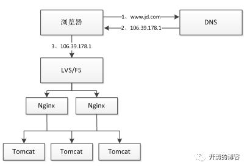
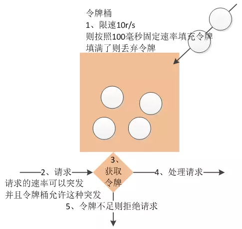
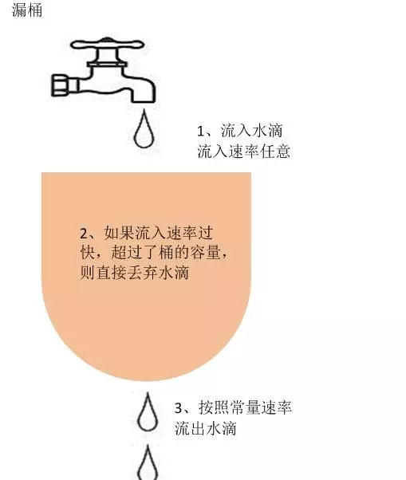

第1部分 概述

# 1 交易型系统设计的一些原则 

* 墨菲定律
* 康威定律[文章1](https://yq.aliyun.com/articles/8611) [文章2](https://www.infoq.cn/article/every-architect-should-study-conway-law)


## 1.1 高并发原则

### 1.1.1 无状态

目的水平扩展。实际情况可能是应用无状态，配置文件有状态。不同机房读取不同数据源，需要配置文件或者配置中心指定。

### 1.1.2 拆分

* 系统维度（按功能、业务）
* 功能维度（对一个系统进行功能细分）
* 读写维度（根据读写频率分离）
* AOP维度？（CDN就是一个AOP系统？）
* 模块维度（如Web，Service，DAO划分）

### 1.1.3 服务化


### 1.1.4 消息队列

目的：服务解耦（一对多消费），异步处理，流量削峰/缓冲等。注意处理消息失败，和重复接收。


* 大流量缓冲
    * 如先放redis，然后记录日志，后台用worker同步db
* 数据校验
    * 异步情况下需要定期扫描原始表对业务数据进行校对/补偿。

### 1.1.5 数据异构

> 异构数据源（disparate data source）广义上讲是指数据结构、存取方式、形式不一样的多个数据源。

```
什么是异构？

简单的说就是指一个整体中包含有不同的成分的特性，即这个整体由多个不同的成分构成。

在信息技术中，异构一词通常用来形容一个包含或者组成“异构网络”的产品。

所谓的“异构网络”通常指不同厂家的产品所组成的网络，而且各厂家产品具有互操作性。通过制定统一规范，不同厂家的硬件软件产品也可以组成统一网络，并且互相通信。

互联网就是一个典型的异构网络。

意思就是说：由不同的成分构成一个整体来共同实现某种功能。
举个简单例子：一辆汽车的制造可以有不同的国家来分别制造零部件，这些零部件共同构成了这个汽车。可以说这个汽车是异构的。

大数据量的异构处理？
通过MQ机制接收数据变更，然后原子化存储到合适的存储引擎，如Redis、ES或持久化KV存储。

数据闭环和数据异构其实是一个概念，目的都是实现数据的自我控制，当其它系统出问题时不影响自己的系统，或者自己出问题时不影响其它系统。

一般通过消息队列来实现数据分发
```

[从淘宝“已买到的宝贝”开始，聊聊数据（库）异构的应用](http://tech.dianwoda.com/2017/09/19/cong-tao-bao-yi-mai-dao-de-bao-bei-kai-shi-liao-liao-shu-ju-ku-yi-gou-zai-shi-yong/)

[数据异构的武器-BINLOG+MQ](https://www.jianshu.com/p/99d1762b2fda)


### 1.1.6 缓存银弹

* 浏览器缓存
* APP缓存（资源提前下发到客户端）
* CDN缓存
* 接入层缓存（nginx增加缓存）
* 应用层缓存（tomcat后台缓存）
* 分布式缓存

### 1.1.7 并发化


## 1.2 高可用原则

在开发高并发系统时有三把利器用来保护系统：缓存、降级和限流。

### 1.2.1 降级

丢卒保帅

降级的最终目的是保证核心服务可用，即使是有损的。而且有些服务是无法降级的（如加入购物车、结算）。

很重要的就是降级开关。[聊聊高并发系统之降级特技](http://blog.jobbole.com/104699/)

### 1.2.2 限流

目的是防止恶意流量，恶意攻击，可以考虑如下思路：

1、恶意流量只访问cache；

2、对于穿透到后端应用的可以考虑使用nginx的limit模块处理；

3、对于恶意ip可以使用如nginx deny进行屏蔽。

大部分时候是不进行接入层限流的，而是限制流量穿透到后端薄弱的应用层

### 1.2.3 切流量

对于一个大型应用，切流量是非常重要的，比如多机房有机房挂了、或者有机架挂了、或者有服务器挂了等都需要切流量，可以使用如下手段进行切换：

1、DNS：切换机房入口；

2、HttpDNS：APP场景下

2、LVS/HaProxy：切换故障的nginx接入层；

3、Nginx：切换故障的应用层；

另外我们有些应用为了更方便切换，还可以在nginx接入层做切换，通过nginx进行一些流量切换，而没有通过如LVS/HaProxy做切换。

### 1.2.4 可回滚

* 事务回滚
* 代码库回滚
* 部署版本回滚
* 数据版本回滚
* 静态资源版本回滚

## 1.3 业务设计原则

### 1.3.1 防重设计

### 1.3.2 幂等设计

### 1.3.3 流程可定义

### 1.3.4 状态与状态机

* 正向状态（待付款、代发货、已发货、完成）和逆向状态（取消、退款）分离存储
* 可以使用状态机驱动状态的变更
* 需要考虑状态并发修改

### 1.3.5 后台系统操作可反馈

可预览

### 1.3.6 后台系统审批化

### 1.3.7 文档和注释

### 1.3.8 备份

## 1.4 总结

[笔记](http://ifeve.com/jd-read-service/)


---
# 第2部分 高可用


# 2 负载均衡与反向代理



关心几个方面：

- 上游服务器配置：使用upstream 配置
- 负载均衡算法
- 失败重试
- 服务器心跳检测

## 2.1 upstream配置

```
upstream backend{
    server 1.2.3.4 weight=1;
    server 1.2.3.5 weight=2;
}
```

## 2.2 负载均衡算法

- round-robin: 轮询
- ip_hash
- hash key [consistent]
- least_conn: 将请求负载均衡到最少活跃连接的上游服务器。  


## 2.3 失败重试

```
upstream backend{
    server 1.2.3.4 max_fails=2 fail_timeout=10s weight=1;
    server 1.2.3.5 max_fails=2 fail_timeout=10s weight=2;
}
```

## 2.4 健康检查

### 2.4.1 TCP心跳检查 TCP心跳检查

```
upstream backend{
    server 1.2.3.4 weight=1;
    server 1.2.3.5 weight=2;
    check interval=3000 rise=1 fall=3 timeout=2000 type=tcp;
}
```

### 2.4.2 HTTP心跳检查


```
upstream backend{
    server 1.2.3.4 weight=1;
    server 1.2.3.5 weight=2;
    check interval=3000 rise=1 fall=3 timeout=2000 type=http;
    check_http_send "HEAD /status HTTP/1.0\r\n\r\n";
    check_http_expect_alive http_2xx http_3xx;
}
```

## 2.5 其他配置

### 2.5.1 域名上游服务器

```
upstream backend{
    server xiaowenjie.cn;
}
```

域名ip改变的时候，upstrem不会更新。商业版才支持动态更新。

### 2.5.2 备份上游服务器

```
upstream backend{
    server 1.2.3.4 weight=1;
    server 1.2.3.5 weight=2 backup;
}
```

### 2.5.3 不可用上游服务器

```
upstream backend{
    server 1.2.3.4:8080 weight=1;
    server 1.2.3.5:9090 weight=2 down;
}
```

## 2.6 长连接

```
upstream backend{
    server 1.2.3.4 weight=1;
    server 1.2.3.5 weight=2 backup;
    keepalive 100;
}
```

## 2.7 HTTP反向代理示例


## 2.8 HTTP动态负载均衡

增减机器的时候，无法自动注册到 upstream 中，可以使用 Consul 解决。

Consul 开源的分布式服务注册与发现系统，通过HTTP API可以使得服务注册、发现实现起来非常简单。

### 2.8.1 Consul+Consul-template 

服务（如tomcat，springboot）启动的时候，调用 `consul java client ` API 实现注册。然后在 `Rumtime.getRuntime().addShutdownHook` 里面删除掉。

[Consul-Template&Nginx实现Consul集群高可用](https://blog.csdn.net/songhaifengshuaige/article/details/79111676)

[Consul+Registrator+Consul-template实现动态修改nginx配置文件](http://www.codexiu.cn/nginx/blog/12503/)

这种方法需要 reload nginx，社区版可以使用Tengine的Dyups模块，微博的Upsync模块和使用OpenResty的balancer_by_lua 脚本 这3中方式实现不reload也能动态注册。

### 2.8.2 Consul+OpenResty

使用 OpenResty 的 balancer_by_lua 脚本 无reload动态负载均衡

[Nginx+Lua开发](https://blog.csdn.net/l09711/article/details/46563953)

原理：nginx启动的时候会调用 init_by_lua ，启动时拉去配置，并更新到共享字典来存储 upstream 列表，然后通过 init_worker_by_lua 启动定时器，定期去 consul 拉去配置并实施更新到共享字典。


## 2.9 Nginx四层负载均衡

1.9.0 版本开始支持。前面的 `upstream` 是 `HTTP七层负载均衡`，这里说的是 `TCP四层负载均衡` 使用的是 `stream` 。

[linux负载均衡总结性说明（四层负载/七层负载）](http://www.cnblogs.com/kevingrace/p/6137881.html)

### 2.9.1 静态负载均衡

ngx_stream_core_module 默认没有启用，可以使用 --with-stream 启用。

> ./configure --prefix=/usr/servers --with-stream

```
stream{
    upstream xxx{

    }

    server{
        
    }
}
```

### 2.9.2 动态负载均衡

- ngx_stream_upsync_module 四层负载均衡(TCP)
- ngx_upsync_module 七层负载均衡(HTTP)

不需要reload


---

# 3 隔离术 

## 3.1 线程隔离

独立线程池

## 3.2 进程隔离

子应用

## 3.3 集群隔离

## 3.4 机房隔离

## 3.5 读写隔离

## 3.6 动静隔离

CDN

## 3.7 爬虫隔离

爬虫流量可能更加高

```
set $flag 0;

if($http_user_agent ~* "spider"){
    set $flag 1;
}

if($flag = "0"){
    // 
}

if($flag = "1"){

}
```

## 3.8 热点隔离


## 3.9 资源隔离

## 3.10 使用Hystrix实现隔离

[使用 Hystrix 实现自动降级与依赖隔离](http://www.importnew.com/25704.html)

[Hystrix线程隔离技术解析-线程池](https://www.jianshu.com/p/df1525d58c20)


## 3.11 基于Servlet 3实现请求隔离

servlet 异步servlet可以单独设置线程池，不同业务放入不同线程池。

[Servlet 3特性：异步Servlet](http://www.importnew.com/8864.html)


```java
@WebListener
public class AppContextListener implements ServletContextListener {
 
    public void contextInitialized(ServletContextEvent servletContextEvent) {
 
        // create the thread pool
        ThreadPoolExecutor executor = new ThreadPoolExecutor(100, 200, 50000L,
                TimeUnit.MILLISECONDS, new ArrayBlockingQueue<Runnable>(100));
        servletContextEvent.getServletContext().setAttribute("executor",
                executor);
 
    }
 
    public void contextDestroyed(ServletContextEvent servletContextEvent) {
        ThreadPoolExecutor executor = (ThreadPoolExecutor) servletContextEvent
                .getServletContext().getAttribute("executor");
        executor.shutdown();
    }
 
}
```

HttpServlet 里面不同业务可以使用不同线程池。

```java
@WebServlet(urlPatterns = "/AsyncLongRunningServlet", asyncSupported = true)
public class AsyncLongRunningServlet extends HttpServlet {
    private static final long serialVersionUID = 1L;
 
    protected void doGet(HttpServletRequest request,
            HttpServletResponse response) throws ServletException, IOException {
        long startTime = System.currentTimeMillis();
        System.out.println("AsyncLongRunningServlet Start::Name="
                + Thread.currentThread().getName() + "::ID="
                + Thread.currentThread().getId());
 
        request.setAttribute("org.apache.catalina.ASYNC_SUPPORTED", true);
 
        String time = request.getParameter("time");
        int secs = Integer.valueOf(time);
        // max 10 seconds
        if (secs > 10000)
            secs = 10000;
 
        AsyncContext asyncCtx = request.startAsync();
        asyncCtx.addListener(new AppAsyncListener());
        asyncCtx.setTimeout(9000);
 
        ThreadPoolExecutor executor = (ThreadPoolExecutor) request
                .getServletContext().getAttribute("executor");
 
        executor.execute(new AsyncRequestProcessor(asyncCtx, secs));
        long endTime = System.currentTimeMillis();
        System.out.println("AsyncLongRunningServlet End::Name="
                + Thread.currentThread().getName() + "::ID="
                + Thread.currentThread().getId() + "::Time Taken="
                + (endTime - startTime) + " ms.");
    }
}
```

---

# 4 限流详解

## 4.1 限流算法

[SOA架构之限流](http://www.cnblogs.com/yeahwell/p/7518514.html)

### 4.1.1 令牌桶算法



### 4.1.2 漏桶算法



## 4.2 应用级限流

### 4.2.1 限流总并发/连接/请求数

Tomcat Connector 配置

```
<Connector port="8080" protocol="HTTP/1.1"
               connectionTimeout="20000"
               redirectPort="8443"
               maxThreads="800" maxConnections="2000" acceptCount="1000"/>
```

[Tomcat-connector的微调(1): acceptCount参数](http://ifeve.com/tomcat-connector-tuning-1/)

[Tomcat-connector的微调(2): maxConnections, maxThreads](http://ifeve.com/tomcat-connector-tuning-2/)

### 4.2.2 限流总资源数

### 4.2.3 限流某个接口的总并发/请求数

### 4.2.4 限流某个接口的时间窗请求数

### 4.2.5 平滑限流某个接口的请求数

Guava RateLimiter 提供的令牌桶算法可用于平滑突发限流（SmoothBursty）和平滑预热限流（SmoothWarmingUp）实现。

[Guava官方文档-RateLimiter类](http://ifeve.com/guava-ratelimiter/)

[RateLimit--使用guava来做接口限流](https://blog.csdn.net/JIESA/article/details/50412027)

[限流 - Guava RateLimiter](https://my.oschina.net/xinxingegeya/blog/2251853)

- SmoothBursty

```java
public static void testWithRateLimiter() {
    Long start = System.currentTimeMillis();
    
    // 每秒不超过10个任务被提交
    RateLimiter limiter = RateLimiter.create(10.0); 
    
    for (int i = 0; i < 10; i++) {
        limiter.acquire(); // 请求RateLimiter, 超过permits会被阻塞
        System.out.println("call execute.." + i);    
    }

    Long end = System.currentTimeMillis();
    
    System.out.println(end - start);
}
```

- SmoothWarmingUp

```java
RateLimiter limiter = RateLimiter.create(5, 1000, TimeUnit.MILLISECONDS);

System.out.println(limiter.acquire());
System.out.println(limiter.acquire());
System.out.println(limiter.acquire());
System.out.println(limiter.acquire());
System.out.println(limiter.acquire());

Thread.sleep(1000L);
System.out.println("sleep end...");

System.out.println(limiter.acquire());
System.out.println(limiter.acquire());
System.out.println(limiter.acquire());
System.out.println(limiter.acquire());
System.out.println(limiter.acquire());
```


## 4.3 分布式限流

4.3.1 Redis+Lua实现 / 76
4.3.2 Nginx+Lua实现 / 77
4.4 接入层限流 / 78
4.4.1 ngx_http_limit_conn_module / 78
4.4.2 ngx_http_limit_req_module / 80
4.4.3 lua-resty-limit-traffic / 88
4.5 节流 / 90
4.5.1 throttleFirst/throttleLast / 90
4.5.2 throttleWithTimeout / 91
参考资料 / 92
5 降级特技 / 93
5.1 降级预案 / 93
5.2 自动开关降级 / 95
5.2.1 超时降级 / 95
5.2.2 统计失败次数降级 / 95
5.2.3 故障降级 / 95
5.2.4 限流降级 / 95
5.3 人工开关降级 / 96
5.4 读服务降级 / 96
5.5 写服务降级 / 97
5.6 多级降级 / 98
5.7 配置中心 / 100
5.7.1 应用层API封装 / 100
5.7.2 配置文件实现开关配置 / 101
5.7.3 配置中心实现开关配置 / 102
5.8 使用Hystrix实现降级 / 106
5.9 使用Hystrix实现熔断 / 108
5.9.1 熔断机制实现 / 108
5.9.2 配置示例 / 112
5.9.3 采样统计 / 113
6 超时与重试机制 / 117
6.1 简介 / 117
6.2 代理层超时与重试 / 119
6.2.1 Nginx / 119
6.2.2 Twemproxy / 126
6.3 Web容器超时 / 127
6.4 中间件客户端超时与重试 / 127
6.5 数据库客户端超时 / 131
6.6 NoSQL客户端超时 / 134
6.7 业务超时 / 135
6.8 前端Ajax超时 / 135
6.9 总结 / 136
6.10 参考资料 / 137
7 回滚机制 / 139
7.1 事务回滚 / 139
7.2 代码库回滚 / 140
7.3 部署版本回滚 / 141
7.4 数据版本回滚 / 142
7.5 静态资源版本回滚 / 143
8 压测与预案 / 145
8.1 系统压测 / 145
8.1.1 线下压测 / 146
8.1.2 线上压测 / 146
8.2 系统优化和容灾 / 147
8.3 应急预案 / 148
第3部分 高并发 / 153
9 应用级缓存 / 154
9.1 缓存简介 / 154
9.2 缓存命中率 / 155
9.3 缓存回收策略 / 155
9.3.1 基于空间 / 155
9.3.2 基于容量 / 155
9.3.3 基于时间 / 155
9.3.4 基于Java对象引用 / 156
9.3.5 回收算法 / 156
9.4 Java缓存类型 / 156
9.4.1 堆缓存 / 158
9.4.2 堆外缓存 / 162
9.4.3 磁盘缓存 / 162
9.4.4 分布式缓存 / 164
9.4.5 多级缓存 / 166
9.5 应用级缓存示例 / 167
9.5.1 多级缓存API封装 / 167
9.5.2 NULL Cache / 170
9.5.3 强制获取最新数据 / 170
9.5.4 失败统计 / 171
9.5.5 延迟报警 / 171
9.6 缓存使用模式实践 / 172
9.6.1 Cache-Aside / 173
9.6.2 Cache-As-SoR / 174
9.6.3 Read-Through / 174
9.6.4 Write-Through / 176
9.6.5 Write-Behind / 177
9.6.6 Copy Pattern / 181
9.7 性能测试 / 181
9.8 参考资料 / 182
10 HTTP缓存 / 183
10.1 简介 / 183
10.2 HTTP缓存 / 184
10.2.1 Last-Modified / 184
10.2.2 ETag / 190
10.2.3 总结 / 192
10.3 HttpClient客户端缓存 / 192
10.3.1 主流程 / 195
10.3.2 清除无效缓存 / 195
10.3.3 查找缓存 / 196
10.3.4 缓存未命中 / 198
10.3.5 缓存命中 / 198
10.3.6 缓存内容陈旧需重新验证 / 202
10.3.7 缓存内容无效需重新执行请求 / 205
10.3.8 缓存响应 / 206
10.3.9 缓存头总结 / 207
10.4 Nginx HTTP缓存设置 / 208
10.4.1 expires / 208
10.4.2 if-modified-since / 209
10.4.3 nginx proxy_pass / 209
10.5 Nginx代理层缓存 / 212
10.5.1 Nginx代理层缓存配置 / 212
10.5.2 清理缓存 / 215
10.6 一些经验 / 216
参考资料 / 217
11 多级缓存 / 218
11.1 多级缓存介绍 / 218
11.2 如何缓存数据 / 220
11.2.1 过期与不过期 / 220
11.2.2 维度化缓存与增量缓存 / 221
11.2.3 大Value缓存 / 221
11.2.4 热点缓存 / 221
11.3 分布式缓存与应用负载均衡 / 222
11.3.1 缓存分布式 / 222
11.3.2 应用负载均衡 / 222
11.4 热点数据与更新缓存 / 223
11.4.1 单机全量缓存+主从 / 223
11.4.2 分布式缓存+应用本地热点 / 224
11.5 更新缓存与原子性 / 225
11.6 缓存崩溃与快速修复 / 226
11.6.1 取模 / 226
11.6.2 一致性哈希 / 226
11.6.3 快速恢复 / 226
12 连接池线程池详解 / 227
12.1 数据库连接池 / 227
12.1.1 DBCP连接池配置 / 228
12.1.2 DBCP配置建议 / 233
12.1.3 数据库驱动超时实现 / 234
12.1.4 连接池使用的一些建议 / 235
12.2 HttpClient连接池 / 236
12.2.1 HttpClient 4.5.2配置 / 236
12.2.2 HttpClient连接池源码分析 / 240
12.2.3 HttpClient 4.2.3配置 / 241
12.2.4 问题示例 / 243
12.3 线程池 / 244
12.3.1 Java线程池 / 245
12.3.2 Tomcat线程池配置 / 248
13 异步并发实战 / 250
13.1 同步阻塞调用 / 251
13.2 异步Future / 252
13.3 异步Callback / 253
13.4 异步编排CompletableFuture / 254
13.5 异步Web服务实现 / 257
13.6 请求缓存 / 259
13.7 请求合并 / 261
14 如何扩容 / 266
14.1 单体应用垂直扩容 / 267
14.2 单体应用水平扩容 / 267
14.3 应用拆分 / 268
14.4 数据库拆分 / 271
14.5 数据库分库分表示例 / 275
14.5.1 应用层还是中间件层 / 275
14.5.2 分库分表策略 / 277
14.5.3 使用sharding-jdbc分库分表 / 279
14.5.4 sharding-jdbc分库分表配置 / 279
14.5.5 使用sharding-jdbc读写分离 / 283
14.6 数据异构 / 284
14.6.1 查询维度异构 / 284
14.6.2 聚合数据异构 / 285
14.7 任务系统扩容 / 285
14.7.1 简单任务 / 285
14.7.2 分布式任务 / 287
14.7.3 Elastic-Job简介 / 287
14.7.4 Elastic-Job-Lite功能与架构 / 287
14.7.5 Elastic-Job-Lite示例 / 288
15 队列术 / 295
15.1 应用场景 / 295
15.2 缓冲队列 / 296
15.3 任务队列 / 297
15.4 消息队列 / 297
15.5 请求队列 / 299
15.6 数据总线队列 / 300
15.7 混合队列 / 301
15.8 其他队列 / 302
15.9 Disruptor+Redis队列 / 303
15.10 下单系统水平可扩展架构 / 311
第4部分 案例 / 323
16 构建需求响应式亿级商品详情页 / 324
16.1 商品详情页是什么 / 324
16.2 商品详情页前端结构 / 325
16.3 我们的性能数据 / 327
16.4 单品页流量特点 / 327
16.5 单品页技术架构发展 / 327
16.5.1 架构1.0 / 328
16.5.2 架构2.0 / 328
16.5.3 架构3.0 / 330
16.6 详情页架构设计原则 / 332
16.7 遇到的一些坑和问题 / 339
16.8 其他 / 347
17 京东商品详情页服务闭环实践 / 348
17.1 为什么需要统一服务 / 348
17.2 整体架构 / 349
17.3 一些架构思路和总结 / 350
17.4 引入Nginx接入层 / 354
17.5 前端业务逻辑后置 / 356
17.6 前端接口服务端聚合 / 357
17.7 服务隔离 / 359
18 使用OpenResty开发高性能Web应用 / 360
18.1 OpenResty简介 / 361
18.1.1 Nginx优点 / 361
18.1.2 Lua的优点 / 361
18.1.3 什么是ngx_lua / 361
18.1.4 开发环境 / 362
18.1.5 OpenResty生态 / 362
18.1.6 场景 / 362
18.2 基于OpenResty的常用架构模式 / 363
18.3 如何使用OpenResty开发Web应用 / 371
18.4 基于OpenResty的常用功能总结 / 375
18.5 一些问题 / 376
19 应用数据静态化架构高性能单页Web应用 / 377
19.1 整体架构 / 378
19.2 数据和模板动态化 / 381
19.3 多版本机制 / 381
19.4 异常问题 / 382
20 使用OpenResty开发Web服务 / 383
20.1 架构 / 383
20.2 单DB架构 / 384
20.3 实现 / 387
21 使用OpenResty开发商品详情页 / 405
21.1 技术选型 / 407
21.2 核心流程 / 408
21.3 项目搭建 / 408
21.4 数据存储实现 / 410
21.5 动态服务实现 / 422
21.6 前端展示实现 / 430